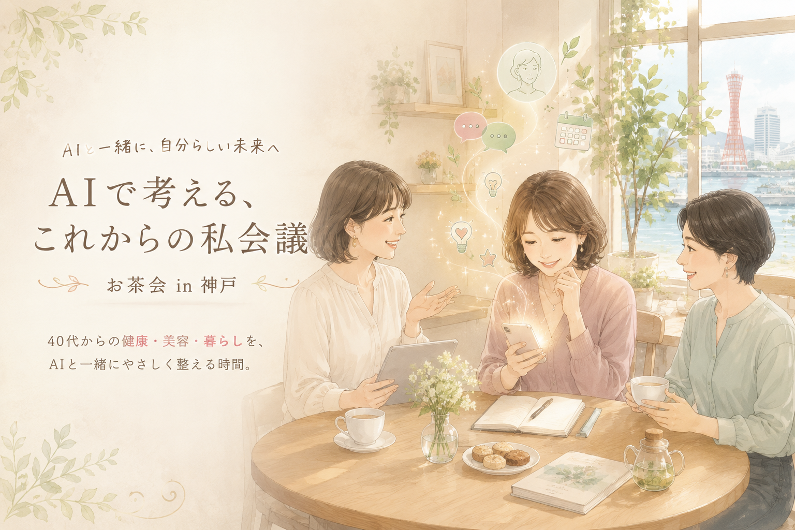

# AIで考える、これからの私会議｜既存トップ画像維持版

この版では、ユーザーが先に採用した美しい `top.png` をトップにそのまま使います。

## 最重要
この一式は、既存の `top.png` を置き換えない構成です。
`index.html` のトップは必ず次を参照します。

```html

```

したがって、既存プロジェクトへ反映する際は **今ある top.png を削除・置換しないでください。**

## コピー対象
- `index.html`
- `style.css`
- `script.js`
- `assets/assistant-plan.png`

## 反映
```bash
cd ~/Documents/watashi-kaigi
mkdir -p assets
# 展開先から index.html style.css script.js と assets/assistant-plan.png をコピー
git add index.html style.css script.js assets/assistant-plan.png
git commit -m "Update concept while keeping original top image"
git push
```

`top.png` は `git add` しなくて大丈夫です。既にリポジトリにあるなら、そのまま維持されます。
